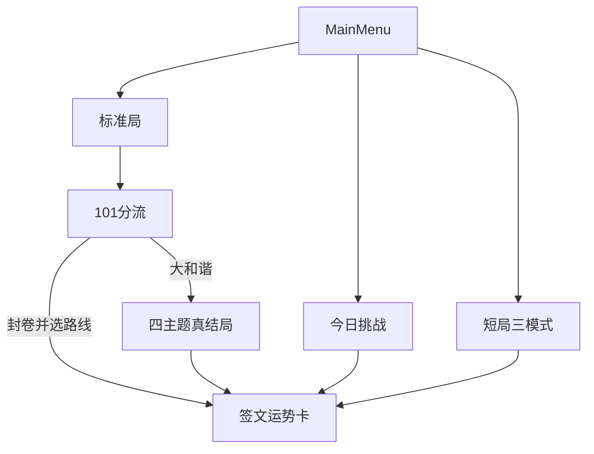

# 马马合体：可玩性与发行完整方案

当前骨架已经能通关、四结局、隐藏技、今日挑战。缺口是**重玩钩子、短局、可晒物、中段变化、真机能打开**。BGM 按你的选择：**先程序化分章换调 + 文件挂点**，mp3/ogg 以后直接替换。

不做：8×8、账号排行榜、图鉴 3D 旋转、`Game.ts`/`Grid.ts` 一次性拆到 700 行（只抽新模块，避免和玩法改动缠在一起）。




---

## 0. 共用底座：对局配置

现在 `Game.init` 是散字段（`continueRun` / `dailySeed` / `startItems` / `bossId`）。短局、客串马、路线锁定都会再加字段，必须先收口。

在 [frontend/src/types.ts](frontend/src/types.ts) 增加：

```ts
type RunMode = 'standard' | 'daily' | 'sprint' | 'bossRush' | 'recipeHunt';
interface RunConfig {
  mode: RunMode;
  continueRun?: boolean;
  dailySeed?: string;
  startItems?: string[];
  bossId?: string;
  guestId?: string;
  routeLock?: EndingRouteStyle;
}
```

[frontend/src/scenes/Game.ts](frontend/src/scenes/Game.ts) 只认 `RunConfig`。[MainMenu.ts](frontend/src/scenes/MainMenu.ts) 所有入口走它。`RunStateManager` 快照写入 `mode` / `dailySeed` / `guestId` / `routeLock`，修好「今日挑战点菜单再继续会丢掉每日规则」的现有缺口。

数值一律进 [frontend/src/data/balance.json](frontend/src/data/balance.json) 新节：`modes`、`fortune`、`pairBonus`、`events`、`audio`、`shopDaily`。

---

## Wave A — 可追、可晒（标准局立刻变好玩）

### A1. 图鉴完成度

[Gallery.ts](frontend/src/scenes/Gallery.ts) 标题下加一行：`角色 12/96 · 配方 3/8 · 真结局 1/4`。分母：非 `hiddenEnding` 公开角色、全部配方、四条结局。点进度可看「还差什么」（未发现配方只给梗提示，不露真名）。

### A2. 配方可发现

未发现配方卡改为：类型「变异/催化」可见，说明用半遮梗（例如「听岔」「加班」「出镜被和谐」），材料用剪影字 `？ + ？`。[recipes.json](frontend/src/data/recipes.json) 加 `hint` 字段。发现后才露真名、材料、结果。

### A3. 101 自选路线

[Game.ts `showLevel101ChoiceOverlay](frontend/src/scenes/Game.ts)` 在「结束游戏」下增加四张路线小按钮（赛博 / 古风 / 动漫 / 神话）。

- 点路线 = 以该风格**封卷**（`normalEnding` + `routeLock`）。
- 「挑战大和谐」仍自动打分；若玩家刚锁过路线，大和谐结算以锁为权重加成而不是硬覆盖（保持「追路线」）。
- 死局不选手动路线。

### A4. 本局签文 + 真运势卡

新增 [frontend/src/utils/fortune.ts](frontend/src/utils/fortune.ts)：用最高马、路线、是否发现隐藏配方、死/封/真，拼 3 句签（吉/损各一池，可复现：`dailySeed` 或局分作种子）。

[GameOver.ts](frontend/src/scenes/GameOver.ts) 的「炫耀一下」不再整屏 `snapshot`：在离屏容器里画 **720×1280 签文卡**（立绘窗 + 路线名 + 三句签 + 分数），再 `snapshot` 这一层。每日挑战保留一键复制文案，并带上签文。

失败也走同一套：死局标题用盘面最高梗角色的丧签，不用通用 Game Over。

---

## Wave B — 短局、客串、经济

主菜单「开始游戏」旁加「短局」再进三选一，避免主菜单按钮爆炸。


| 模式                   | 规则                                                 | 结束              |
| -------------------- | -------------------------------------------------- | --------------- |
| 三十步冲分 `sprint`       | 30 次有效滑动；无悔棋；无开局补给                                 | 步数用尽或死局         |
| Boss Rush `bossRush` | 从章节带开局；Boss 间隔缩短（`balance.modes.bossRushInterval`） | 击败 3 个 Boss 或死局 |
| 配方猎人 `recipeHunt`    | 只计突变；Spawn 提高 `recipeSpawnChance`                  | 发现 3 条新配方或死局    |


三种都写命运报告 + 签文；不进大和谐（短局没有 101 压力）。图鉴解锁照常。

**客串一日马：** `dailySeed` 哈希到一只 `recipeOnly` 或 Lv.8–40 公开马，进局 toast「今日客串：某某」。图鉴记 `seenGuests`（见过 ≠ 解锁）。仅今日挑战。

**经济：**

- 局内 `runGold` 加 cap（如 5000，进 `balance`）。
- 今日挑战 / 短局商店用独立日钱包 `dailyGold`（每日重置，不花传承金）。
- 标准局商店按章轮换货架：每章只上 4 件，避免后期买穿。

---

## Wave C — 中段趣味与成双

### C1. 章节一次性事件

在 [ChapterTracker](frontend/src/managers/ChapterTracker.ts) 切章时（约 Lv.16 / 46 / 76）触发**本局仅一次**事件，全用现有棋子/VFX，不新画资源：

- 奇种涌现：下 5 次生成 `recipe_help` 必中一半材料。
- 神话加速：下一次 Boss 提前 8 回合。
- 终章星穹：低段生成再降一档，逼经营。

修现有文案错位：HUD 切章在 ≥91 必须显示「大和谐」，与 Tracker 一致。

### C2. 成双检定

盘上同时存在「成对梗」时给 8 回合光环（合成分 ×1.25，飘「成双」）。配对表写死在数据里，例如 `bamboo_horse+white_base`、`sophist_white+auntie_ma`。不改合成公式，只改反馈与签文素材。

### C3. 普通技能一小段演出

不为全部 `arch_*` 做四拍 Hidden 大片。给 8–10 个高辨识角色加 **0.6s 吐槽条**（角色名 + 一句 skill 梗），复用 [SetpiecePlayer](frontend/src/managers/SetpiecePlayer.ts) 的 `label` + 整层销毁。Hidden 九技保持原四拍。

候选：竹马、波加曼、白马非马、木马号、马踏飞燕、伯乐、麒麟、宇宙神驹（非 Hidden 签名的那些用短条）。

### C4. 濒死仪式

`finalizeDeadlockCheck` 在「仍有自救」时：压力条拉满、BGM 切濒死调、toast「还能翻」；放弃钮文案改成盘面最高角色的丧签前半句。无自救才立即结算。

### C5. 伯乐封卷（轻量）

选「结束游戏」且未点四路线时：列出当前棋盘最高 6 只马，点 2 只确认封卷。用这两只的 tag 加权 `evaluateEndingRoute`，签文点名这两只。点了四路线则跳过此步。

---

## Wave D — 音频、性能、能发出去

### D1. 静音 / 音量 / BGM 挂点

- [AudioManager](frontend/src/managers/AudioManager.ts)：`volume` 0–1 写入 `horse_merge_volume`；`playBgm(palette)` 四套程序化音阶（标准 / 终章 / 濒死 / 真结局）。
- `playBgm` 若 `textures` 同级存在 `assets/audio/bgm_{palette}.ogg` 则播文件，否则振荡器。Preloader 尝试加载，失败静默。
- 局内顶栏加静音钮，不再只在主菜单且 `scene.restart()`。

### D2. 加载

- 主菜单预载策略保持；图鉴末页四结局图按需 `ensureCharacter`。
- Preloader 完成前显示「正在备马」；`index.html` 去掉默认 `/vite.svg`，避免 404。
- 不在本波做 WebP 再压（P1 已做过）；只保证延迟加载路径无问号卡死。

### D3. PWA / 静态可发布

- [frontend/index.html](frontend/index.html)：`manifest.webmanifest`、`theme-color`、`apple-mobile-web-app-capable`。
- `public/manifest.webmanifest` + 复用现有 `border_ssr`/`bg_main_menu` 做图标（不新绘）。
- 可选极简 SW：仅 cache `index.html` + `assets/ui/*`；角色图仍走现有延迟加载。
- README 补：`npm run build` → 托管 `frontend/dist`。

---

## 文档

每波结束后勾选 [requirements.md](requirements.md) 与 [project planning.md](project planning.md)（Phase 11 新节）。不改 Phase 1–5 那些历史空框。

---

## 开发顺序与验收

按 A→B→C→D 提交，每波可单独试玩：

- A：图鉴有进度；未发现配方有梗无剧透；101 能点四路线封卷；结算下载的是签文卡不是整屏 HUD。
- B：三短局能从菜单进、能结算、不污染标准存档；今日客串只影响挑战；商店不再无限买。
- C：切章有一次性事件；成双会飘字；濒死有仪式；伯乐两选影响签文。
- D：局内静音立刻生效；无 ogg 时仍有程序化 BGM；`npm run build` 的 dist 可当静态站；手机可「添加到主屏幕」。

